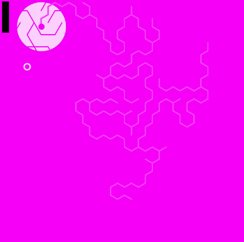

# Purple Maze

It's a maze game, written in Reason.
Planning to target mobile, web, and native desktop.

I'll probably spin out a couple of the parts into standalone libraries (`Geom.re` in particular).

## License

This code is licensed under [Creative Commons Attribution-NonCommercial 4.0](https://creativecommons.org/licenses/by-nc/4.0/legalcode) (CC BY-NC 4.0). If you use this code, you must attribute me (Jared Forsyth), and link back to this repository.
If you want me to license parts of the codebase under a more permissive license, such as one that allows commercial use, you're welcome to ask.
